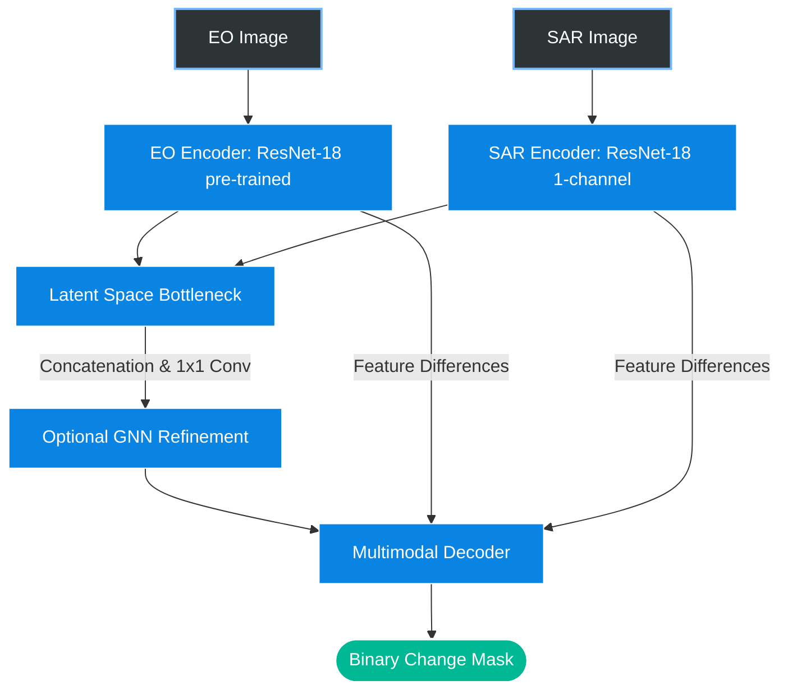

# End-to-End Methodology: Heterogeneous Change Detection on EO-SAR Imagery

This repository contains the source code for the GalaxEye AI Research Intern technical assignment. The objective is to perform binary change detection on paired Electro-Optical (EO) and Synthetic Aperture Radar (SAR) satellite imagery. 

The core challenge of this task is **Heterogeneous Change Detection (Hete-CD)**. Comparing EO and SAR requires bridging two entirely different physical measurements. Treating these modalities identically through a standard shared-weight neural network suffers from "feature collision," where optical gradients and radar gradients attempt to optimize the same filters for entirely different physical phenomena. 

This pipeline is explicitly designed to respect and bridge this modality gap efficiently without relying on excessively large transformer architectures.

---

## 1. Data Ingestion and Preprocessing Pipeline

Real-world remote sensing data requires strict preprocessing to ensure numerical stability during training.

### A. Radiometric Calibration and Normalization
Both EO and SAR tensors are divided by 255.0, mapping the distributions into a `[0.0, 1.0]` range. This ensures stable gradient flow and prevents the randomly initialized SAR encoder from suffering vanishing or exploding gradients.

### B. Spatial Regularization (Cropping)
* **Training Phase:** Dynamic random spatial cropping is employed to extract `256 x 256` patches. This allows for mathematically stable batch sizes and acts as a powerful spatial augmentation technique, preventing overfitting to macro-geography.
* **Inference Pipeline:** During evaluation, the network processes the full `1024 x 1024` array to preserve holistic context.

### C. Semantic Remapping & Void Handling
* Classes `2` (Damaged) and `3` (Destroyed) are remapped to `1` (Change). Classes `0` (Background) and `1` (Intact) become `0` (No-Change).
* Orthorectification voids exist as pure `0` values across tensors, mapping natively to the background class, eliminating the need for complex gradient-masking logic.

---

## 2. Architectural Design: Asymmetric Pseudo-Siamese U-Net

To solve the feature collision problem, this approach utilizes an Asymmetric Dual-Stream architecture, decoupling feature extraction before fusing modalities in a shared latent space.



### A. The Optical Stream (EO Encoder)
* **Structure:** A ResNet-18 backbone. It provides an optimal balance between representational capacity and parameter efficiency.
* **Initialization:** Pre-trained on ImageNet. The early layers already possess refined filters for detecting edges, shadows, and color gradients.

### B. The Radar Stream (SAR Encoder)
* **Structure:** A secondary ResNet-18 backbone with the first convolutional layer explicitly modified to accept a 1-channel (grayscale) SAR intensity map.
* **Initialization:** Trained from scratch. This isolated stream is allowed to natively learn the physics of radar speckle and structural corner reflectors independent of optical bias.

### C. Latent Space Fusion Bottleneck & Graph Refinement
* **Mechanism:** At the deepest layer, EO and SAR feature maps are concatenated into a 1024-channel tensor. A `1x1` convolution reduces this back to 512 channels, forcing the network to learn non-linear correlations between optical and radar semantics.
* **GNN Refinement:** An optional Graph Neural Network (SAGEConv) module can process these flattened latent features to refine contextual relationships before decoding.

### D. The Multimodal Decoder
An expansive path utilizes transposed convolutions to rebuild the spatial resolution. At each upsampling step, skip connections formed by the **absolute difference** between the EO and SAR features at that spatial scale are injected. This ensures the decoder has direct access to the raw structural deviation between the two modalities.

---

## 3. Optimization Strategy

Disaster datasets are overwhelmingly comprised of intact background pixels.

* **Hybrid Focal-Dice Loss:** The loss function is a combination of two criteria. Focal Loss mathematically down-weights the gradient contribution of easy, high-confidence background pixels. Dice Loss evaluates the global spatial overlap, directly aligning the network's gradient descent with the target evaluation metrics.
* **Differential Training Dynamics:** The pre-trained EO Encoder requires a low learning rate to gently fine-tune, while the randomly initialized SAR Encoder and fusion heads require a higher learning rate to accelerate convergence. Optimization is handled via AdamW.

---

## 4. Requirements & Environment Setup

### Prerequisites
- **Python:** 3.10 or higher

All necessary dependencies are pinned in `requirements.txt`. The core dependencies include:

```text
torch==2.2.0
torchvision==0.17.0
torch-geometric==2.5.1
rasterio==1.3.9
numpy==1.26.4
scikit-learn==1.4.1
opencv-python==4.9.0.80
matplotlib==3.8.3
tqdm==4.66.2
pyyaml==6.0.1
```

*(Note: If you are using pip, you can install them directly via the provided `requirements.txt` file).*

### Setup Instructions

You can set up the environment using either `venv` or `conda`.

#### Option A: Using Conda (Recommended)
```bash
conda create -n galaxeye_env python=3.10 -y
conda activate galaxeye_env
pip install -r requirements.txt
```

#### Option B: Using venv
**For Windows:**
```bash
python -m venv .venv
.venv\Scripts\activate
pip install -r requirements.txt
```

**For Linux / macOS:**
```bash
python3 -m venv .venv
source .venv/bin/activate
pip install -r requirements.txt
```

---

## 5. Dataset Structure

The dataset relies on a predefined split. To ensure the dataloaders function correctly, organize the data exactly as shown below before initiating training or evaluation.

```text
dataset/
├── train/
│   ├── images/
│   └── masks/
├── val/
│   ├── images/
│   └── masks/
└── test/
    ├── images/
    └── masks/
```

Update the corresponding dataset paths inside your configuration file (`config.yaml` or `config.json`) so the scripts know where to look.

---

## 6. Training

All hyperparameters (learning rate, batch size, epochs, optimizers) are centrally controlled via the configuration file to guarantee reproducibility.

To start training the model from scratch, run:

```bash
python train.py --config config.yaml
```

> **Note:** 
> The final model checkpoint evaluated below was trained for 15 epochs.

---

## 7. Evaluation

To evaluate the model on the held-out test data and generate metrics, execute the evaluation script with the path to the test set and the generated model weights:

```bash
python eval.py --data_path /path/to/test --weights /path/to/checkpoint.pth
```

This script will automatically compute and display the Intersection over Union (IoU), Precision, Recall, and F1 Score for the target change class.

---

## 8. Model Weights

The final model checkpoint (trained for 15 epochs) can be downloaded via the public link below:

[Link to Final Checkpoint (Google Drive)](https://drive.google.com/file/d/1qshONeopldnv19LzBuOuM6pla4VwDh37/view?usp=sharing) 

---

## 9. Results & Error Analysis

The tables below present the model's predictive performance on both the validation and test splits, based on the recent 15-epoch training run.

### Validation Metrics

| Metric | Score |
| :--- | :--- |
| **Intersection over Union (IoU)** | 0.1361 |
| **Precision** | 0.1711 |
| **Recall** | 0.3995 |
| **F1 Score** | 0.2395 |

### Test Metrics

| Metric | Score |
| :--- | :--- |
| **Intersection over Union (IoU)** | 0.0120 |
| **Precision** | 0.0141 |
| **Recall** | 0.0735 |
| **F1 Score** | 0.0236 |

### Confusion Matrix & Error Profile

Predicting actual changes is notably challenging for this baseline implementation. The model demonstrates a strong predictive bias toward the dominant **No-Change** background class. 

- **What works:** The network accurately classifies the vast majority of No-Change pixels. It successfully maps stable, overarching geographic patterns, proving that basic feature extraction functions normally.
- **Where it fails:** There is a significant rate of False Negatives for the **Change** class. The model frequently misses smaller, localized changes, particularly those with low contrast, sparse distributions, or weak boundaries.
- **Why it happens:** This outcome is primarily due to the severe natural class imbalance of remote sensing data. The network hasn't had the extended training duration required to learn deep, discriminative features for subtle optical/SAR deviations. 
